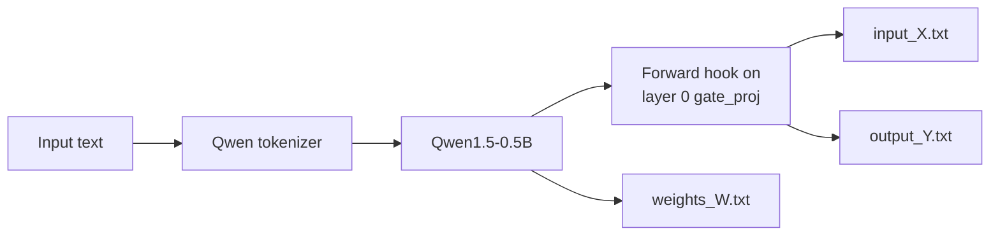

# Qwen MLP Matrix Extraction Utility

[](https://www.python.org/)
[](https://pytorch.org/)
[](https://huggingface.co/docs/transformers/)
[](https://huggingface.co/Qwen/Qwen1.5-0.5B)
[](https://developer.nvidia.com/cuda-zone)

A small PyTorch utility for extracting the input activation, weight matrix, and output activation of the first MLP gate-projection layer in **Qwen1.5-0.5B**.

The generated matrices can be used for:

- GEMM accelerator validation
- FPGA golden-model generation
- Matrix-layout analysis
- Quantization experiments
- Hardware–software numerical comparison
- Debugging custom matrix-multiplication implementations

## Extracted Operation

The script captures the first transformer layer’s MLP gate projection:

```python
model.model.layers[0].mlp.gate_proj
```

PyTorch applies the linear operation:

```text
Y = X × Wᵀ
```

where:

| Matrix | Meaning | Observed shape |
|---|---|---:|
| `X` | Input activation | `3 × 1024` |
| `W` | Gate-projection weight | `2816 × 1024` |
| `Y` | Output activation | `3 × 2816` |

The number of activation rows depends on the tokenization of the input prompt. The included files were generated from:

```text
FPGA design
```

## Repository Contents

```text
QWEN/
├── qwen.py       # Model loading and tensor-extraction script
├── input_X.txt   # Captured gate-projection input activation
├── weights_W.txt # Gate-projection weight matrix
└── output_Y.txt  # Captured gate-projection output activation
```

## How It Works



The script performs the following steps:

1. Downloads the Qwen tokenizer and model.
2. Loads the model on a CUDA-compatible GPU using FP16.
3. Selects the first decoder layer’s MLP gate projection.
4. Copies the gate-projection weight matrix to CPU memory.
5. Registers a PyTorch forward hook.
6. Runs inference on the text `FPGA design`.
7. Captures the layer input and output.
8. Reshapes the activations into two-dimensional matrices.
9. Saves all matrices as text files.

## Requirements

- Python 3.9 or newer
- PyTorch
- Hugging Face Transformers
- NumPy
- CUDA-compatible NVIDIA GPU
- Sufficient storage for model files and extracted matrices
- Internet access during the initial model download

Install the Python dependencies:

```bash
python -m pip install torch transformers accelerate numpy
```

Install the CUDA-enabled PyTorch build appropriate for your operating system and CUDA version.

## Running the Extraction

Clone the repository:

```bash
git clone https://github.com/nguyen-ky2910/QWEN.git
cd QWEN
```

Run the script:

```bash
python qwen.py
```

Expected console output:

```text
Loading model...
Saved weights.
Calculating...
Saved inputs and outputs.
Done!
```

After execution, the following files are created or replaced:

```text
input_X.txt
weights_W.txt
output_Y.txt
```

## Output Format

Each file is saved with NumPy using:

```python
np.savetxt(filename, matrix, fmt="%.6f")
```

Therefore:

- Each line represents one matrix row.
- Values are separated by spaces.
- Values are stored in decimal floating-point format.
- Each value is rounded to six digits after the decimal point.

## Verifying the Extracted Matrices

The captured output can be reconstructed using NumPy:

```python
import numpy as np

X = np.loadtxt("input_X.txt", dtype=np.float32)
W = np.loadtxt("weights_W.txt", dtype=np.float32)
Y_reference = np.loadtxt("output_Y.txt", dtype=np.float32)

Y_reconstructed = X @ W.T

difference = Y_reconstructed - Y_reference

print("X shape:", X.shape)
print("W shape:", W.shape)
print("Y shape:", Y_reference.shape)
print("Maximum absolute error:", np.max(np.abs(difference)))
print("Mean absolute error:", np.mean(np.abs(difference)))
```

Small differences are expected because:

- The model is executed using FP16.
- Text files retain only six decimal places.
- NumPy reconstruction may use FP32 arithmetic.
- GPU and CPU accumulation orders may differ.

## Using the Data for FPGA Validation

For hardware validation, the floating-point matrices typically require:

1. Selection of an INT8 quantization policy.
2. Calculation of activation and weight scaling factors.
3. Quantization of `X` and `W`.
4. Padding K and N dimensions to the hardware tile size.
5. Reordering values into the accelerator’s stream layout.
6. Hardware execution.
7. Restoration of hardware output to floating point.
8. Comparison against `output_Y.txt`.

Recommended numerical metrics include:

```text
Mean Absolute Error
Root Mean Squared Error
Normalized RMSE
Relative L2 Error
Cosine Similarity
Maximum Absolute Error
```

Do not compare raw INT8 accelerator output directly against the floating-point file without applying the corresponding scale and output-restoration procedure.

## Changing the Prompt

Edit:

```python
text_input = "FPGA design"
```

For example:

```python
text_input = "Explain systolic array acceleration."
```

A different prompt may produce a different number of tokens and therefore a different number of rows in `input_X.txt` and `output_Y.txt`.

## Selecting Another Layer

The current target is:

```python
layer_module = model.model.layers[0].mlp.gate_proj
```

Examples of other candidate projections include:

```python
model.model.layers[0].mlp.up_proj
model.model.layers[0].mlp.down_proj
model.model.layers[0].self_attn.q_proj
model.model.layers[0].self_attn.k_proj
model.model.layers[0].self_attn.v_proj
model.model.layers[0].self_attn.o_proj
```

Verify the model architecture and tensor dimensions before changing the selected module.

## Limitations

- The script requires a CUDA GPU in its current form.
- Only one layer and one operator are captured.
- Only one prompt is evaluated.
- The text output files are large and inefficient compared with binary formats.
- Six-decimal text formatting introduces additional rounding.
- The script does not calculate numerical-error metrics automatically.
- It does not perform quantization or FPGA-specific packing.

For repeated experiments, consider saving matrices in `.npy` or `.npz` format to preserve precision and reduce loading time.

## Author

Developed by [nguyen-ky2910](https://github.com/nguyen-ky2910) for studying Qwen matrix operations and validating custom GEMM acceleration workflows.

## License

No license file is currently included. Add an appropriate license before distributing or reusing the original script.

The Qwen model and Hugging Face dependencies remain subject to their respective licenses and terms.
